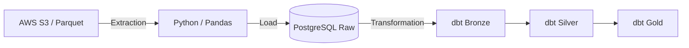

# 🍫 Projeto ChocolateDados: Pipeline de Dados & Modelagem dbt

Este projeto demonstra uma pipeline de dados ponta a ponta (End-to-End), realizando a ingestão de dados brutos a partir de um bucket **AWS S3** para um banco de dados **PostgreSQL**, seguida pela transformação e modelagem de dados utilizando o **dbt (data build tool)**.

---

## 🚀 Visão Geral da Arquitetura

1.  **Ingestão (S3 -> DB):** Uma pipeline (Python) extrai arquivos Parquet do AWS S3 e os carrega no schema `raw` do banco de dados.
2.  **Transformação (dbt):**
    * **Camada Bronze:** Espelhamento dos dados brutos com definições de fontes (`sources`).
    * **Camada Silver:** Limpeza de dados, cast de tipos (datas, decimais), tratamento de nulos e padronização.
    * **Camada Gold (Em breve):** Tabelas de negócio (Fatos e Dimensões) prontas para BI.

---

## 🛠️ Pipeline de Ingestão (Python & AWS)

Antes da modelagem no dbt, os dados passam por um fluxo de **Extração e Carga (EL)** automatizado via Python. O objetivo é garantir que o dado chegue ao PostgreSQL exatamente como está na origem (fidelidade total).

### Resumo do Fluxo de Ingestão:
1.  **Conexão com o Data Lake:** Autenticação e conexão com os buckets da AWS S3.
2.  **Download de Arquivos:** Captura dos 4 arquivos principais (vendas, produtos, clientes e lojas).
3.  **Conversão para DataFrames:** Processamento dos arquivos utilizando a biblioteca Pandas.
4.  **Carga no PostgreSQL:** Salvamento dos dados no schema `raw`, preservando a estrutura original dos arquivos **Parquet**.

> **Nota de Arquitetura:** Este projeto utiliza a estratégia **ELT**. Os dados são salvos exatamente como vêm do parquet (fase EL), deixando toda a lógica de negócio e limpeza para ser executada dentro do banco de dados através do dbt (fase T).

---

## 🏗️ Estrutura da Pipeline de Dados


---

## 📂 Estrutura do Repositório dbt

* `models/bronze/`: Modelos que limpam levemente os dados da fonte.
* `models/silver/`: Modelos com regras de negócio, conversão de moedas e padronização de nomes.
* `models/sources.yml`: Definição das tabelas de origem no banco de dados.

---

## 🛠️ Tecnologias Utilizadas

* **Banco de Dados:** PostgreSQL
* **Data Warehouse Tool:** dbt (version 1.11.7)
* **Storage:** AWS S3
* **Linguagem:** SQL

---

## ⚙️ Como Executar o Projeto

### 1. Requisitos Prévios
* Python 3.8+ instalado.
* Acesso ao banco de dados onde os dados do S3 foram carregados.

### 2. Configuração do Ambiente
Clone o repositório e instale as dependências:
```bash
git clone https://github.com/natanmatos0/chocolateDados.git
cd chocolateDados
pip install dbt-core dbt-postgres
